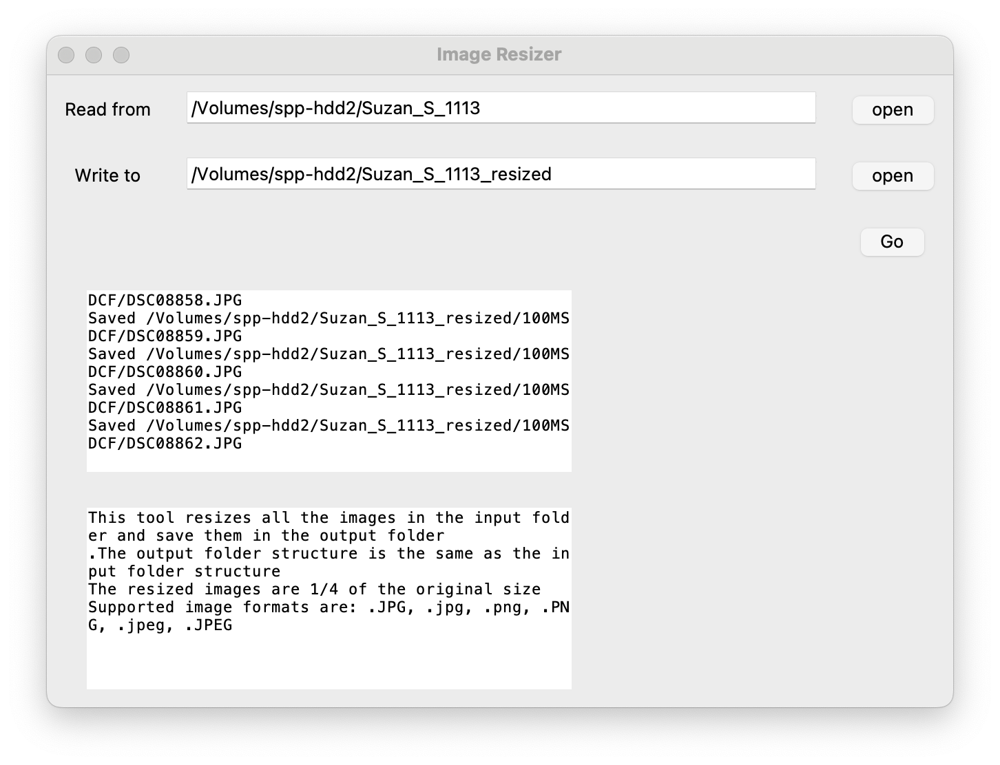

# Nano Image Resize Tool

Resize all the images 1/4 in the folder recursively and save them to the target folder.


## Run
```
python main.py
```

## Build
```
pyinstaller main.py --name resize_tool --onefile -w
```
